# SusIna
First Android Project using Java.  

<i><b>A Realtime Chat App that includes features:</b></i>  
<ul>
  <i>
<li>Real-time Chat</li>
<li>Authentication</li>
<li>Biometric login</ii>
<li>Email verification </li>
<li>Email and Password update</li>
<li>Email and Password validation</li>
<li>Password reset </li>
<li>Account deletion</li>
<li>Profile Settings</li>
<li>Find friends</li>
 
  </i>
</ul>

# ScreenShots

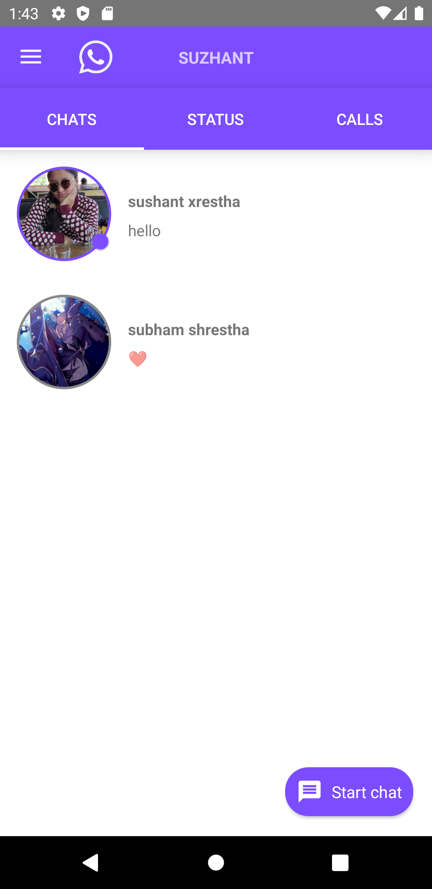 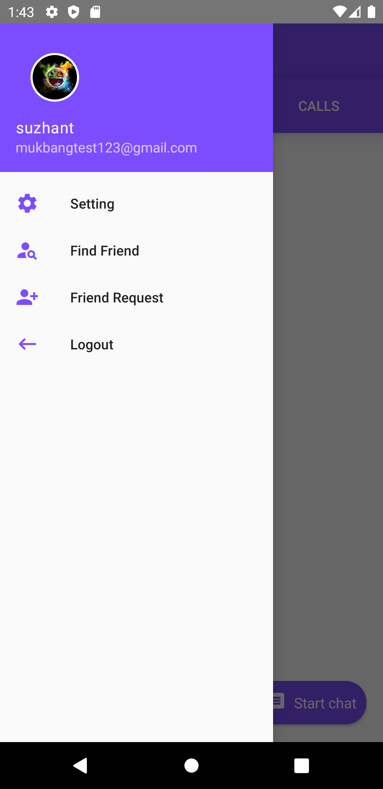 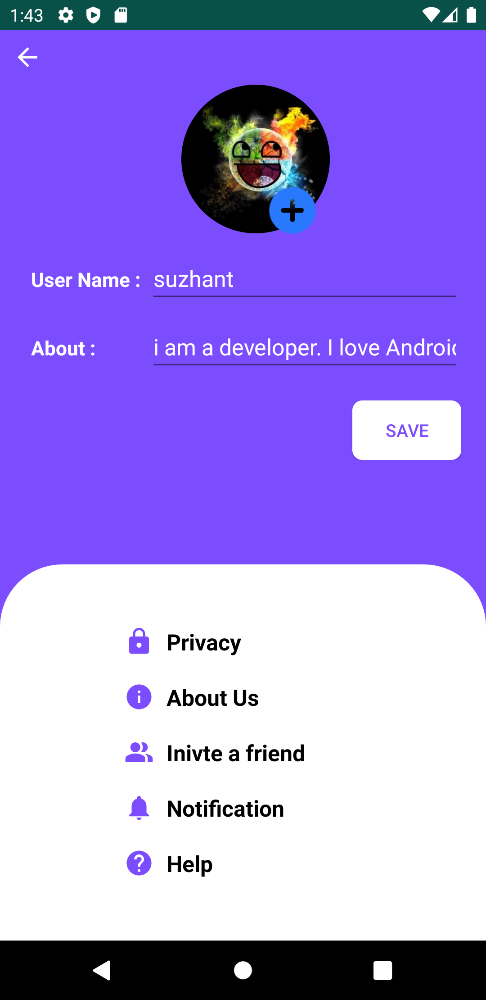
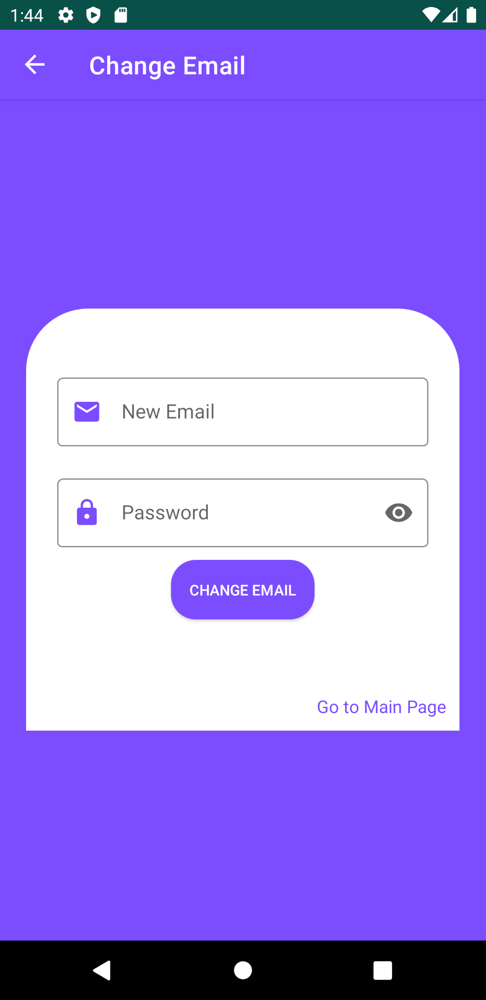  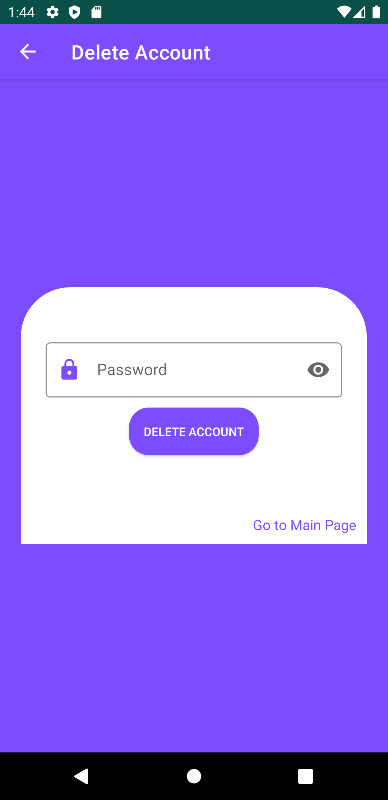
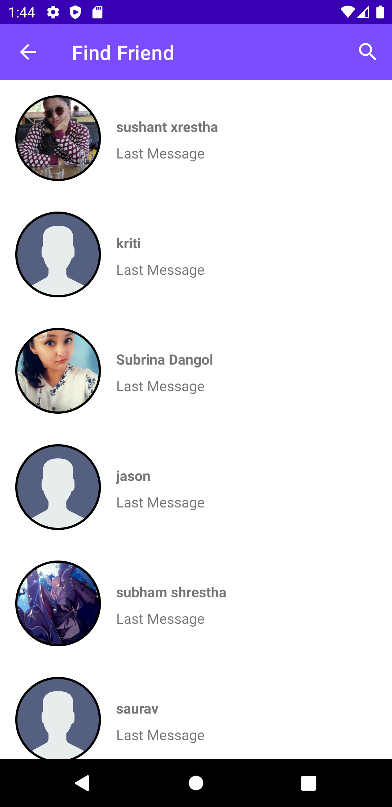 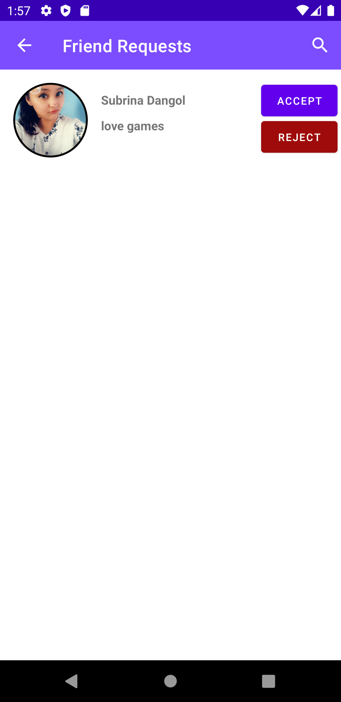 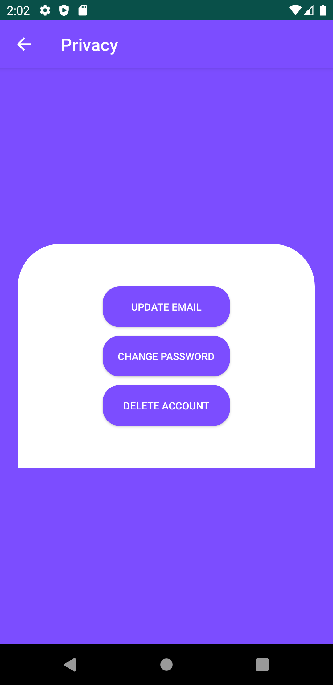
 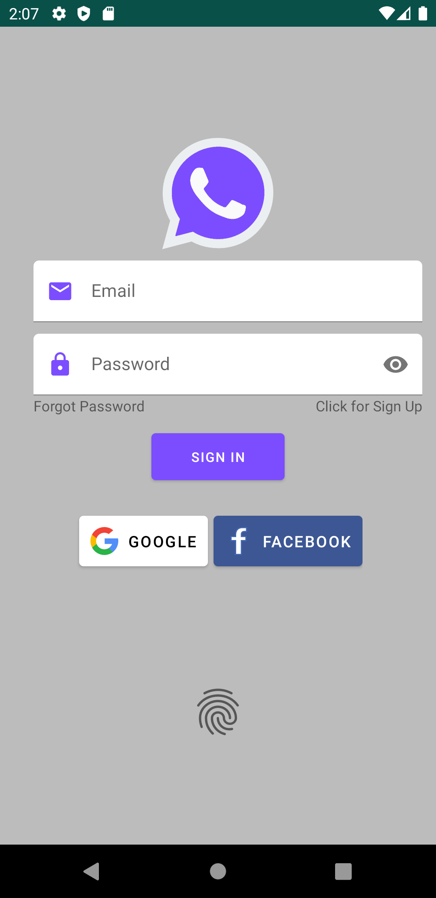 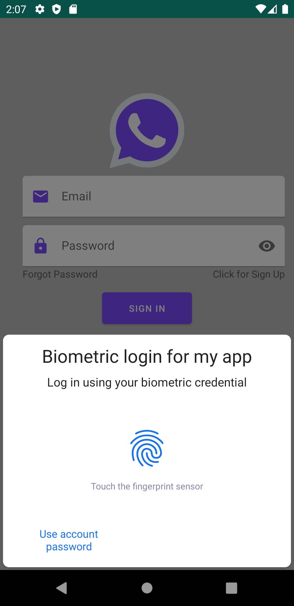
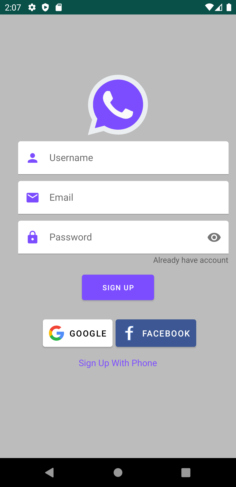 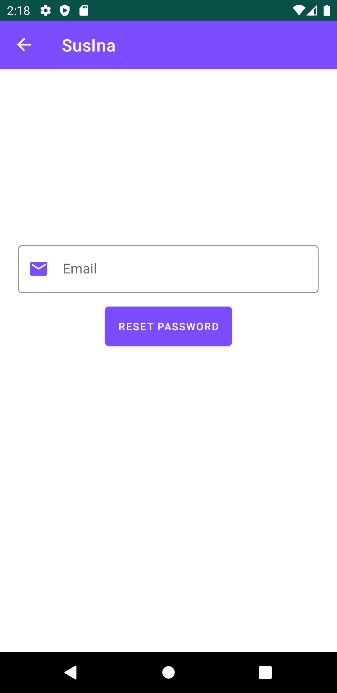 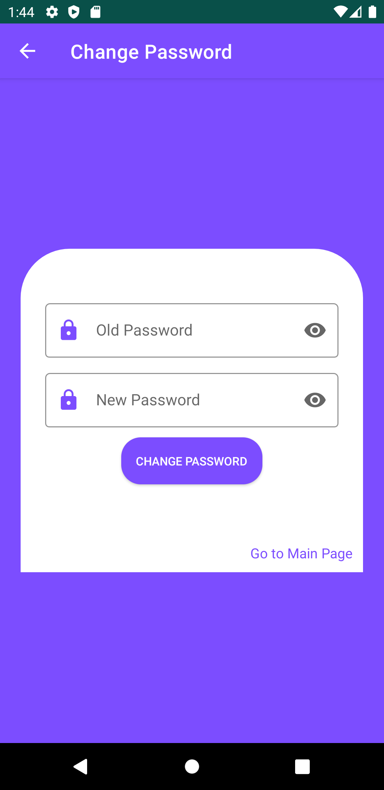
