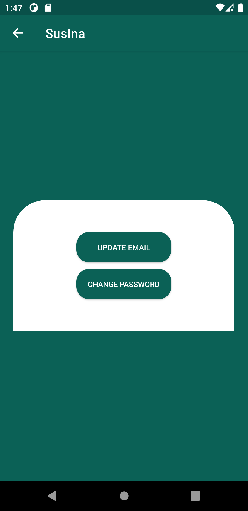

# SusIna
First Android Project using Java.  

<i><b>A Realtime Chat App that includes features:</b></i>  
<ul>
  <i>
<li>Real-time Chat</li>
<li>Authentication</li>
<li>Biometric login</ii>
<li>Email verification </li>
<li>Email and Password update</li>
<li>Email and Password validation</li>
<li>Password reset </li>
<li>Account deletion</li>
<li>Profile Settings</li>
  </i>
</ul>

<b>There are still lots of bugs to be fixed and features to be added. I will continue the project after exam.</b>

# ScreenShots

  
  
  
