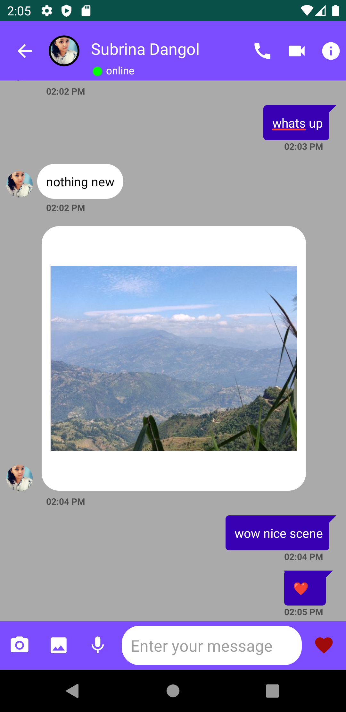

# SusIna
First Android Project using Java.  

<i><b>A Chat App that includes features:</b></i>  
<ul>
  <i>
<li>Real-time Chat</li>
<li>Group Chat</li>
<li>Video Chat</li> 
<li>online Presence Capability</li> 
<li>Share feature inside and outside app</li>  
<li>Authentication</li>
<li>Biometric login</ii>
<li>Email verification </li>
<li>Password reset </li>
<li>Account deletion</li>

  </i>
</ul>

# ScreenShots

  
  
  
  
  
